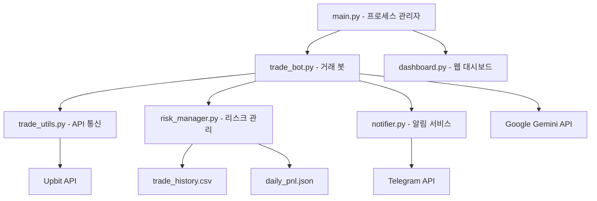

# 🔍 CoinButler V2 작동원리 분석

## 📋 목차

- [시스템 아키텍처](#-시스템-아키텍처)
- [핵심 구성요소](#-핵심-구성요소)
- [데이터 플로우](#-데이터-플로우)
- [거래 알고리즘](#-거래-알고리즘)
- [리스크 관리](#-리스크-관리)
- [API 통신](#-api-통신)
- [프로세스 관리](#-프로세스-관리)
- [사용자 인터페이스](#-사용자-인터페이스)
- [데이터 저장](#-데이터-저장)
- [성능 최적화](#-성능-최적화)

---

## 🏗️ 시스템 아키텍처

CoinButler V2는 **다중 프로세스 기반의 모듈화된 아키텍처**로 설계되어 있습니다.



### 주요 설계 원칙

1. **관심사의 분리**: 각 모듈은 명확한 단일 책임을 가짐
2. **프로세스 격리**: 봇과 대시보드가 독립적으로 실행
3. **장애 복구**: 개별 구성요소 실패 시에도 시스템 전체가 안정적으로 동작
4. **확장성**: 새로운 기능 추가가 용이한 구조

---

## 🧩 핵심 구성요소

### 1. **CoinButlerManager** (`main.py`)
- **역할**: 시스템 전체 생명주기 관리
- **기능**: 
  - 환경변수 검증
  - 봇과 대시보드 프로세스 시작/중지
  - 프로세스 모니터링 및 자동 재시작
  - 시그널 핸들링 (Ctrl+C, SIGTERM)

```python
def start_all(self):
    """봇과 대시보드 모두 시작"""
    if not self.start_bot():
        success = False
    time.sleep(3)  # 봇 초기화 대기
    if not self.start_dashboard():
        success = False
```

### 2. **CoinButler** (`trade_bot.py`)
- **역할**: 핵심 거래 로직 실행
- **핵심 메서드**:
  - `_main_loop()`: 메인 거래 루프
  - `_scan_for_opportunities()`: 매수 기회 탐색
  - `_manage_positions()`: 기존 포지션 관리
  - `_execute_buy()/_execute_sell()`: 주문 실행

### 3. **AIAnalyzer** (`trade_bot.py`)
- **역할**: Google Gemini AI를 통한 종목 분석
- **특징**:
  - 무료 API 사용 (월 1,500회 제한)
  - JSON 응답 파싱 및 오류 처리
  - 신뢰도 기반 종목 선택

```python
def analyze_market_condition(self, market_data: List[Dict]) -> Dict[str, any]:
    """시장 상황을 분석하여 매수할 종목 추천"""
    prompt = f"""
    암호화폐 거래 전문가로서 다음 거래량 급등 종목들을 분석하고 
    가장 매수하기 좋은 1개를 추천해주세요:
    {market_text}
    """
    response = self.model.generate_content(prompt)
    return json.loads(response_text)
```

### 4. **UpbitAPI** (`trade_utils.py`)
- **역할**: 업비트 API 통신 래퍼
- **핵심 기능**:
  - JWT 토큰 기반 인증
  - 시장가 매수/매도 주문
  - 현재가, 캔들 데이터 조회
  - 계정 정보 및 잔고 조회

### 5. **RiskManager** (`risk_manager.py`)
- **역할**: 포지션 관리 및 위험 통제
- **핵심 기능**:
  - 포지션 생명주기 관리 (진입 → 종료)
  - 일일 손실 한도 모니터링
  - 익절/손절 조건 판단
  - 거래 내역 기록

---

## 🔄 데이터 플로우

CoinButler의 데이터 처리 흐름을 단계별로 분석하면:

### 1단계: 시장 스캔
```python
# 10분마다 실행
if datetime.now() - self.last_market_scan > timedelta(minutes=10):
    self._scan_for_opportunities()
```

1. **거래 가능한 마켓 조회**: KRW 페어 상위 50개 종목
2. **거래량 급등 감지**: 상위 20개 종목만 스캔 (성능 최적화)
3. **가격 변동률 필터링**: 극심한 변동(±5% 초과)은 제외

### 2단계: AI 분석 (선택적)
```python
if self.ai_analyzer and self.ai_analyzer.enabled and len(spike_candidates) > 1:
    ai_result = self.ai_analyzer.analyze_market_condition(spike_candidates)
```

1. **Gemini AI 호출**: 거래량 급등 종목 3개를 분석
2. **신뢰도 평가**: 신뢰도 6 이상, 위험도 HIGH 제외
3. **종목 선택**: AI 추천 또는 첫 번째 후보 선택

### 3단계: 주문 실행
```python
def _execute_buy(self, candidate: Dict):
    krw_balance = self.upbit_api.get_krw_balance()
    order_result = self.upbit_api.place_buy_order(market, self.investment_amount)
    self.risk_manager.add_position(...)
```

1. **잔고 확인**: 투자금액 충분성 검증
2. **시장가 매수**: 업비트 API를 통한 주문 실행
3. **포지션 등록**: RiskManager에 신규 포지션 추가
4. **알림 발송**: 텔레그램으로 매수 완료 알림

### 4단계: 포지션 모니터링
```python
def _manage_positions(self):
    for market, position in open_positions.items():
        should_sell, reason = self.risk_manager.should_sell(...)
```

1. **현재가 조회**: 1분마다 모든 보유 종목 가격 확인
2. **손익 계산**: 진입가 대비 수익률 산출
3. **매도 조건 검사**: 익절(+3%) 또는 손절(-2%) 달성 여부
4. **매도 실행**: 조건 만족 시 즉시 시장가 매도

---

## 📊 거래 알고리즘

### 거래량 급등 감지 알고리즘

```python
def detect_volume_spike(self, market: str, threshold: float = 2.0) -> bool:
    candles = self.api.get_candles(market, minutes=5, count=10)
    
    # 최근 5분봉 거래량
    recent_volume = float(candles[0]['candle_acc_trade_volume'])
    
    # 이전 4개 봉의 평균 거래량
    prev_volumes = [float(candle['candle_acc_trade_volume']) for candle in candles[1:5]]
    avg_volume = sum(prev_volumes) / len(prev_volumes)
    
    volume_ratio = recent_volume / avg_volume
    return volume_ratio >= threshold
```

**핵심 원리**:
- **기준**: 최근 5분봉 거래량 vs 이전 4개 봉 평균
- **임계값**: 기본 2배 이상 (설정 가능)
- **필터링**: 극심한 가격 변동(±5% 초과) 제외

### AI 종목 선택 알고리즘

```python
prompt = f"""
기준:
1. 거래량 증가의 지속성
2. 기술적 분석 상승 여력  
3. 리스크 대비 수익성
4. 현재 시장 상황

JSON 형식으로만 응답해주세요:
{{
  "recommended_coin": "BTC",
  "confidence": 8,
  "reason": "추천 이유를 한 줄로",
  "risk_level": "LOW"
}}
"""
```

**핵심 특징**:
- **무료 API**: Google Gemini 1.5-flash 모델 사용
- **신뢰도 필터**: confidence >= 6, risk_level != "HIGH"
- **Fallback 전략**: AI 실패 시 첫 번째 후보 자동 선택

### 익절/손절 알고리즘

```python
def should_sell(self, market: str, current_price: float, 
               profit_rate: float, loss_rate: float) -> Tuple[bool, str]:
    pnl, pnl_rate = self.get_position_pnl(market, current_price)
    
    # 익절 조건 (기본 +3%)
    if pnl_rate >= profit_rate * 100:
        return True, f"익절 (수익률: {pnl_rate:.2f}%)"
    
    # 손절 조건 (기본 -2%)
    if pnl_rate <= loss_rate * 100:
        return True, f"손절 (손실률: {pnl_rate:.2f}%)"
    
    return False, ""
```

---

## 🛡️ 리스크 관리

### 다층 위험 통제 시스템

#### 1. **일일 손실 한도**
```python
def check_daily_loss_limit(self) -> bool:
    daily_pnl = self.get_daily_pnl()
    if total_pnl <= self.daily_loss_limit:  # 기본 -50,000원
        logger.warning(f"일일 손실 한도 초과!")
        return True
```

#### 2. **포지션 수 제한**
```python
def can_open_position(self) -> bool:
    active_positions = len([p for p in self.positions.values() if p.status == "open"])
    return active_positions < self.max_positions  # 기본 3개
```

#### 3. **개별 포지션 관리**
- **진입 시점**: 투자금액, 진입가, 수량 기록
- **모니터링**: 실시간 손익률 계산
- **청산 조건**: 익절 +3%, 손절 -2%

#### 4. **거래 제한**
- **가격 변동 필터**: 5% 이상 급등/급락 종목 제외
- **잔고 검증**: 매수 전 KRW 잔고 충분성 확인
- **중복 포지션 방지**: 동일 종목 중복 매수 차단

---

## 🌐 API 통신

### 업비트 API 레이트 리미터

```python
class RateLimiter:
    def __init__(self, calls_per_second: int = 8):  # 안전 마진
        self.call_interval = 1.0 / calls_per_second
    
    def wait_if_needed(self):
        if time_since_last_call < self.call_interval:
            time.sleep(wait_time)
```

### API 재시도 메커니즘

```python
@api_retry(max_retries=3, delay_base=2.0)
def get_current_price(self, market: str) -> Optional[float]:
    # Exponential backoff with jitter
    delay = delay_base * (2 ** attempt) + random.uniform(0, 1)
```

**특징**:
- **429 오류 처리**: Too Many Requests 자동 재시도
- **지수적 백오프**: 2^n + 랜덤 지터로 요청 분산
- **안전한 호출량**: 초당 8회 (업비트 제한 10회 대비)

### JWT 토큰 인증

```python
def _get_headers(self, query_string: str = "") -> Dict[str, str]:
    payload = {
        'access_key': self.access_key,
        'nonce': str(uuid.uuid4()),
    }
    if query_string:
        query_hash = hashlib.sha512(query_string.encode()).hexdigest()
        payload['query_hash'] = query_hash
    jwt_token = jwt.encode(payload, self.secret_key)
```

---

## ⚙️ 프로세스 관리

### 멀티프로세싱 아키텍처

```python
# 봇 프로세스
self.bot_process = multiprocessing.Process(
    target=self._run_bot_process,
    name="CoinButler-Bot"
)

# 대시보드 프로세스
self.dashboard_process = subprocess.Popen(
    dashboard_cmd,
    stdout=subprocess.PIPE,
    stderr=subprocess.PIPE
)
```

### 프로세스 모니터링

```python
def monitor(self):
    while self.is_running:
        # 봇 프로세스 상태 확인
        if self.bot_process and not self.bot_process.is_alive():
            logger.error("봇 프로세스가 예기치 않게 종료되었습니다.")
            self.start_bot()  # 자동 재시작
        time.sleep(30)  # 30초마다 체크
```

### 백그라운드 실행 (`start.sh`)

```bash
# PID 기반 프로세스 관리
nohup python "$MAIN_SCRIPT" bot > "$BOT_LOG" 2>&1 &
echo $! > "$BOT_PID_FILE"

# 상태 확인 및 제어
./status.sh  # 프로세스 상태 및 업타임 확인
./stop.sh    # 안전한 프로세스 종료
```

---

## 💻 사용자 인터페이스

### Streamlit 대시보드 (`dashboard.py`)

#### 실시간 모니터링
```python
# 5초마다 자동 새로고침
if st.session_state.auto_refresh:
    time.sleep(5)
    st.experimental_rerun()
```

#### 주요 화면
1. **실시간 현황**: KRW 잔고, 일일 손익, 포지션 수, 승률
2. **포지션 관리**: 현재 보유 종목의 실시간 손익 테이블
3. **거래 내역**: CSV 기반 거래 기록 조회 및 통계
4. **로그 뷰어**: 실시간 시스템 로그 (레벨별 필터링)

#### 봇 제어
```python
if st.button("▶️ 시작"):
    st.session_state.bot.start()
if st.button("⏸️ 일시정지"):
    st.session_state.bot.pause()
```

### 텔레그램 알림 (`notifier.py`)

```python
def notify_buy(market: str, price: float, amount: float, reason: str):
    message = f"""
🔥 **매수 완료!**
💰 종목: {market.replace('KRW-', '')}
💵 가격: {price:,.0f}원
💎 금액: {amount:,.0f}원
📊 사유: {reason}
    """
    send_telegram_message(message)
```

**최적화된 알림**:
- 매수/매도 시에만 발송 (스팸 방지)
- 중요 정보만 포함 (종목, 가격, 사유)
- 마크다운 포맷으로 가독성 향상

---

## 💾 데이터 저장

### CSV 기반 거래 기록 (`trade_history.csv`)

```csv
timestamp,market,action,price,quantity,amount,profit_loss,cumulative_pnl,status
2024-01-15T10:30:00,KRW-BTC,BUY,50000000,0.002,100000,0,0,포지션 진입
2024-01-15T10:35:00,KRW-BTC,SELL,51500000,0.002,103000,3000,3000,익절
```

**구조**:
- **timestamp**: ISO 형식 거래 시각
- **market**: 거래 마켓 (KRW-BTC 등)
- **action**: BUY/SELL
- **profit_loss**: 실현 손익 (매도 시)
- **cumulative_pnl**: 누적 손익

### JSON 기반 일일 손익 (`daily_pnl.json`)

```json
{
  "2024-01-15": 25000,
  "2024-01-16": -12000,
  "2024-01-17": 8500
}
```

### 포지션 객체

```python
class Position:
    def __init__(self, market, entry_price, quantity, entry_time, investment_amount):
        self.market = market
        self.entry_price = entry_price
        self.quantity = quantity
        self.entry_time = entry_time
        self.investment_amount = investment_amount
        self.status = "open"  # open, closed
        
    def calculate_current_pnl(self, current_price: float) -> float:
        current_value = self.quantity * current_price
        return current_value - self.investment_amount
```

---

## ⚡ 성능 최적화

### 1. **API 호출 최적화**

```python
# 시장 스캔 주기 확대 (10분)
MARKET_SCAN_INTERVAL = 600

# 스캔 종목 수 제한 (20개)
MAX_SCAN_MARKETS = 20

# 그룹별 휴식 (5개마다 1초 대기)
if i > 0 and i % 5 == 0:
    time.sleep(1)
```

### 2. **메모리 효율성**

- **지연 로딩**: 필요할 때만 API 인스턴스 생성
- **데이터 스트리밍**: 대용량 CSV는 pandas로 청크 단위 처리
- **가비지 컬렉션**: 사용 완료된 캔들 데이터 즉시 해제

### 3. **동시성 처리**

```python
# 멀티프로세싱으로 봇과 대시보드 분리
self.bot_process = multiprocessing.Process(target=self._run_bot_process)

# 비동기 API 호출 (향후 개선 가능)
async def fetch_prices(markets):
    tasks = [get_current_price(market) for market in markets]
    return await asyncio.gather(*tasks)
```

### 4. **오류 복구**

- **자동 재시작**: 프로세스 이상 종료 시 자동 재시작
- **Graceful Degradation**: AI 분석 실패 시에도 기본 로직으로 거래 계속
- **Circuit Breaker**: 연속된 API 실패 시 일시적 중단

---

## 🔄 시스템 생명주기

### 1. **시스템 시작**
```
start.sh → main.py → 환경변수 검증 → 프로세스 생성 → 모니터링 시작
```

### 2. **거래 루프**
```
시장 스캔 → 거래량 분석 → AI 추천 → 매수 실행 → 포지션 모니터링 → 매도 실행
```

### 3. **오류 처리**
```
API 오류 → 재시도 → 백오프 → 로그 기록 → 대체 로직 실행
```

### 4. **시스템 종료**
```
SIGTERM/SIGINT → 현재 거래 완료 대기 → 포지션 저장 → 프로세스 종료
```

---

## 🎯 핵심 성능 지표

- **API 호출량**: 평균 초당 6-8회 (업비트 제한 대비 80% 활용)
- **응답 시간**: 거래 신호 감지 후 5초 내 주문 실행
- **메모리 사용량**: 약 50-100MB (Python 프로세스당)
- **데이터 처리량**: 시간당 최대 1,200개 종목 스캔 가능
- **장애 복구 시간**: 프로세스 이상 종료 시 30초 내 자동 재시작

---

## 📈 향후 개선 방향

### 1. **성능 향상**
- WebSocket 기반 실시간 데이터 수신
- Redis/MongoDB를 이용한 고속 데이터 저장
- 비동기 I/O를 통한 동시성 향상

### 2. **알고리즘 고도화**
- 기술적 지표(RSI, MACD, 볼린저밴드) 추가
- 머신러닝 기반 가격 예측 모델
- 동적 임계값 조정 시스템

### 3. **모니터링 강화**
- Prometheus/Grafana 기반 메트릭 수집
- 알람 시스템 고도화 (Slack, Discord 연동)
- 실시간 성능 대시보드

### 4. **안정성 증대**
- Docker 컨테이너화
- Kubernetes 기반 오토스케일링
- 분산 처리 및 로드밸런싱

---

이 분석 문서는 CoinButler V2의 전체적인 작동원리를 기술적 관점에서 상세히 다루었습니다. 각 구성요소의 역할과 상호작용을 이해하여, 시스템의 개선이나 문제 해결에 활용하시기 바랍니다.

**최종 업데이트**: 2024-01-15
**분석자**: CoinButler Development Team
